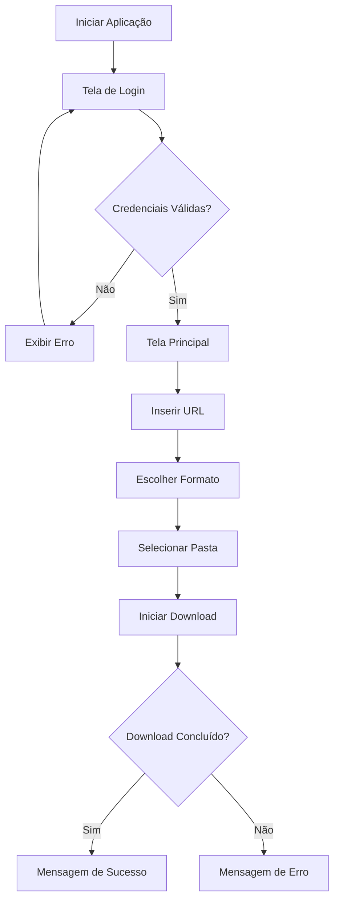

# 🎵 YouTube Downloader Pro

<div align="center">


Aplicação desktop desenvolvida em Python para download de vídeos e áudios do YouTube com autenticação de usuários e interface gráfica intuitiva.

</div>

---

# 📖 Sobre o Projeto

O **YouTube Downloader Pro** é uma aplicação desktop criada em Python com foco em automação de downloads de conteúdo do YouTube.

Através de uma interface gráfica simples e intuitiva, o usuário pode realizar downloads de vídeos em MP4 ou extrair apenas o áudio em MP3, escolhendo livremente a pasta de destino.

Este projeto foi desenvolvido para praticar:

- Desenvolvimento de interfaces gráficas;
- Programação orientada a eventos;
- Integração com bibliotecas externas;
- Manipulação de arquivos;
- Tratamento de exceções;
- Consumo de conteúdo online.

---

# 📸 Demonstrações

## 🔐 Tela de Login

A aplicação inicia com uma tela de autenticação simples, responsável por validar as credenciais antes de liberar o acesso ao sistema.

<p align="center">
  
</p>

### Recursos

- Login de usuários
- Campo de senha protegido
- Opção de lembrar credenciais
- Interface intuitiva

---

## 📥 Tela Principal

Após o login, o usuário acessa a área principal responsável pelos downloads.

<p align="center">
  
</p>

### Recursos

- Campo para URL do YouTube
- Escolha entre MP4 e MP3
- Seleção de diretório de destino
- Área de mensagens e logs
- Botões de download, limpeza e saída

---

# ✨ Funcionalidades

✅ Sistema de autenticação

✅ Download de vídeos do YouTube

✅ Extração de áudio em MP3

✅ Download em MP4

✅ Escolha personalizada da pasta de destino

✅ Criação automática de diretórios

✅ Interface gráfica amigável

✅ Tratamento de erros

✅ Feedback em tempo real para o usuário

---

# 🛠️ Tecnologias Utilizadas

| Tecnologia | Finalidade |
|------------|------------|
| Python | Linguagem principal |
| PySimpleGUI | Interface gráfica |
| yt-dlp | Download de vídeos |
| FFmpeg | Conversão de áudio |
| pathlib | Manipulação de caminhos |
| os | Manipulação de arquivos e diretórios |

---

# 📂 Estrutura do Projeto

```text
YouTube-Downloader-Pro/
│
├── app_downloader.py
├── README.md
│
└── images/
    ├── login.png
    └── downloader.png
```

---

# 🔐 Sistema de Login

A autenticação é realizada localmente através de credenciais previamente cadastradas.

### Usuários de Teste

```text
Usuário: admin
Senha: admin
```

```text
Usuário: user
Senha: 123456
```

---

# 📥 Download de Conteúdo

Após a autenticação, o usuário pode escolher entre dois formatos:

## 🎬 MP4

Realiza o download do vídeo na melhor qualidade disponível.

## 🎵 MP3

Extrai apenas o áudio utilizando FFmpeg para conversão automática.

---

# 🔄 Fluxo da Aplicação



---

# 🚀 Como Executar

## 1. Clone o repositório

```bash
git clone https://github.com/FeeSz/youtube-downloader-pro.git
```

---

## 2. Entre na pasta

```bash
cd youtube-downloader-pro
```

---

## 3. Instale as dependências

```bash
pip install PySimpleGUI
pip install yt-dlp
```

---

## 4. Instale o FFmpeg

Necessário para conversão de áudio para MP3.

### Windows

Baixe o FFmpeg:

https://ffmpeg.org/download.html

Após a instalação, adicione o executável ao PATH do sistema.

---

## 5. Execute a aplicação

```bash
python app_downloader.py
```

---

# 📋 Exemplo de Uso

1. Faça login no sistema.
2. Cole a URL do vídeo desejado.
3. Escolha MP4 ou MP3.
4. Defina uma pasta de destino.
5. Clique em **📥 Baixar**.
6. Aguarde o processamento.

---

# ⚠️ Tratamento de Erros

A aplicação trata automaticamente situações como:

- URL inválida;
- Vídeo indisponível;
- Falha de conexão;
- FFmpeg não instalado;
- Problemas durante o download;
- Falhas de conversão.

Todas as mensagens são exibidas diretamente na interface gráfica.

---

# 💡 Conceitos Aplicados

- Programação Orientada a Eventos
- Desenvolvimento Desktop com Python
- Integração com Bibliotecas Externas
- Tratamento de Exceções
- Manipulação de Arquivos
- Automação de Downloads
- Interface Gráfica (GUI)

---

# 🚀 Melhorias Futuras

- [ ] Barra de progresso em tempo real
- [ ] Download de playlists
- [ ] Download de canais completos
- [ ] Histórico de downloads
- [ ] Sistema de cadastro de usuários
- [ ] Banco de dados SQLite
- [ ] Tema escuro
- [ ] Atualização automática
- [ ] Geração de executável (.exe)

---

# 👨‍💻 Autor

**Felype Souza**

Estudante de Desenvolvimento de Sistemas e desenvolvedor em formação.

🐙 GitHub: https://github.com/FeeSz

🔗 LinkedIn: https://www.linkedin.com/in/felype-souza-4391353a2

---

# 📄 Licença

Este projeto está licenciado sob a Licença MIT.

Consulte o arquivo `LICENSE` para mais informações.
