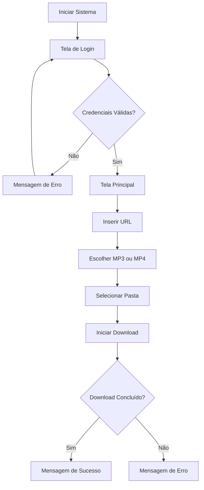

# 🎵 YouTube Downloader Pro

<div align="center">


Aplicação desktop desenvolvida em Python para download de vídeos e áudios do YouTube com autenticação de usuários e interface gráfica intuitiva.

</div>

---

# 📖 Sobre o Projeto

O **YouTube Downloader Pro** é uma aplicação desktop criada em Python que permite realizar downloads de vídeos e músicas do YouTube em diferentes formatos.

A aplicação possui:

- Sistema de login;
- Interface gráfica amigável;
- Download em MP4;
- Conversão para MP3;
- Escolha de pasta de destino;
- Tratamento de erros;
- Feedback em tempo real para o usuário.

---

# 📸 Demonstrações

## 🔐 Tela de Login

Adicione uma captura da tela:

```md

```

---

## 📥 Tela de Download

Adicione uma captura da tela:

```md

```

---

# ✨ Funcionalidades

✅ Sistema de autenticação

✅ Download de vídeos do YouTube

✅ Download de áudio em MP3

✅ Download de vídeo em MP4

✅ Escolha da pasta de destino

✅ Criação automática da pasta de download

✅ Interface gráfica intuitiva

✅ Tratamento de erros

✅ Feedback visual durante o processamento

---

# 🛠️ Tecnologias Utilizadas

| Tecnologia | Finalidade |
|------------|------------|
| Python | Linguagem principal |
| PySimpleGUI | Interface gráfica |
| yt-dlp | Download de vídeos |
| FFmpeg | Conversão para MP3 |
| pathlib | Manipulação de caminhos |
| os | Manipulação de diretórios |

---

# 📂 Estrutura do Projeto

```text
YouTube-Downloader-Pro/
│
├── app_downloader.py
├── README.md
│
└── images/
    ├── login.png
    └── downloader.png
```

---

# 🔐 Sistema de Login

A aplicação possui autenticação local utilizando credenciais pré-configuradas.

## Usuários de teste

```text
Usuário: admin
Senha: admin
```

```text
Usuário: user
Senha: 123456
```

---

# 📥 Download de Conteúdo

Após o login, o usuário pode:

### Baixar vídeo

```text
Formato: MP4
```

Obtém a melhor qualidade disponível.

---

### Baixar áudio

```text
Formato: MP3
```

Realiza extração automática do áudio utilizando FFmpeg.

---

# 🔄 Fluxo da Aplicação



---

# 🚀 Como Executar

## 1. Clonar o Repositório

```bash
git clone https://github.com/FeeSz/youtube-downloader-pro.git
```

---

## 2. Entrar na Pasta

```bash
cd youtube-downloader-pro
```

---

## 3. Instalar Dependências

```bash
pip install PySimpleGUI
pip install yt-dlp
```

---

## 4. Instalar FFmpeg

Necessário para conversão de MP3.

### Windows

Baixe:

https://ffmpeg.org/download.html

Adicione o executável ao PATH do sistema.

---

## 5. Executar

```bash
python app_downloader.py
```

---

# 📋 Exemplo de Uso

1. Faça login.
2. Cole o link do vídeo.
3. Escolha MP3 ou MP4.
4. Defina uma pasta de destino.
5. Clique em **📥 Baixar**.
6. Aguarde a conclusão do processo.

---

# ⚠️ Tratamento de Erros

A aplicação identifica situações como:

- URL inválida;
- Vídeo indisponível;
- Falha na conexão;
- FFmpeg não instalado;
- Erros de download.

Todas as mensagens são exibidas diretamente na interface.

---

# 💡 Conceitos Aplicados

- Interfaces gráficas desktop
- Programação orientada a eventos
- Consumo de conteúdo online
- Manipulação de arquivos
- Tratamento de exceções
- Automação de downloads
- Organização modular de código

---

# 🚀 Melhorias Futuras

- [ ] Histórico de downloads
- [ ] Barra de progresso real
- [ ] Download de playlists
- [ ] Download de canais completos
- [ ] Sistema de cadastro de usuários
- [ ] Banco de dados SQLite
- [ ] Tema escuro
- [ ] Exportação de logs
- [ ] Atualização automática

---

# 👨‍💻 Autor

**Felype Souza**

Estudante de Desenvolvimento de Sistemas e desenvolvedor em formação.

🐙 GitHub: https://github.com/FeeSz

🔗 LinkedIn: https://www.linkedin.com/in/felype-souza-4391353a2

---

# 📄 Licença

Este projeto está licenciado sob a Licença MIT.

Consulte o arquivo `LICENSE` para mais informações.
